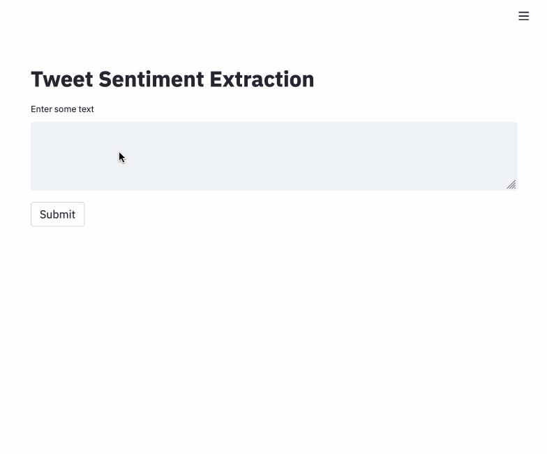

# Tweet Sentiment Extraction

[](https://github.com/psf/black)
[](https://github.com/kingyiusuen/tweet-sentiment-extraction/blob/master/LICENSE)

Predict the sentiment of a tweet and extract a phrase that supports the sentiment.



## Introduction

This project is based on a [Kaggle competition](https://www.kaggle.com/c/tweet-sentiment-extraction/overview). The challenge is to construct a model that look at the labeled sentiment for a given tweet and figure out what word or phrase best supports it. For example, if we are given a tweet like this:

> "My ridiculous dog is amazing." [sentiment: positive]

We need to extract the word "amazing".

This problem can be formulated as an extractive question answering task, where the sentiment is treated as the question, the tweet is treated as the context, and the selected text is the answer.

I fine-tuned a [Roberta model](https://huggingface.co/deepset/roberta-base-squad2) that has been pretrained on Stanford Question Answering Dataset (SQuAD) 2.0, which took fewer than 5 epochs to converge and had a word-level jaccard index of about 0.7 in a validation set.

Submissions to the competition must be made through notebooks with no internet access. However, my method requires downloading a pretrained model, so I can't submit my predictions to Kaggle, and hence I don't know the score of my model in the test set. Nevertheless, it was a good learning experience, as I familiarized myself with the Huggingface package, and tricks to fine-tune a pretrained model (use a small learning rate with a warmup period to avoid catastrophic forgetting).

Things I could've tried:

- Better data cleaning. The selected text of quite a few examples has some unnecessary characters:

| text | selected_text |
|------|---------------|
| On the way to Malaysia...no internet access to Twit. | .no internet |
| which case? I got a new one last week and I \`m not thrilled at all with mine. | d I\`m not thrilled at all with mine. |
| He \`s awesome... Have you worked with him before? He \`s a good friend. | s awesome |

- Replace the model head provided by Huggingface (`RobertaForQuestionAnswering`) with some custom layers, e.g. add dropout.

- Model ensembling (train the model with different backbones and different seeds, and then average their results).

- Label smoothing, which was used in some top-ranked solutions (e.g. [this](https://www.kaggle.com/c/tweet-sentiment-extraction/discussion/159245) and [this](https://www.kaggle.com/c/tweet-sentiment-extraction/discussion/159273)).

In real life, the sentiment of a tweet is not provided. Therefore, in my streamlit app, I used a [pretrainde model](https://huggingface.co/cardiffnlp/twitter-roberta-base-sentiment) that has been fine-tuned for sentiment analysis with ~58M tweets to predict the sentiment of the input text. The sentiment with the highest probability is used as input to the phrase extraction model.

## How to Use

Fine tune the pretrained Roberta model for the phrase extraction task.

```
python scripts/run_experiment --num_epochs=10 --do_fit
```

Download the models. (There are two models, one for sentiment analysis and one for phrase extraction.)

```
python scripts/download_checkpoints.py
```

Run streamlit app.

```
make streamlit
```

# Reference

I did look at some notebooks in Kaggle for reference. (They are all very similar, so I will just cite [this one](https://www.kaggle.com/shoheiazuma/tweet-sentiment-roberta-pytorch).) But I didn't just copy their code, because this competition was held over a year before I started working on this, and there has been some changes to Huggingface's API. Also, notebooks tend to be very messy. I refactored the code in a more object-oriented way.